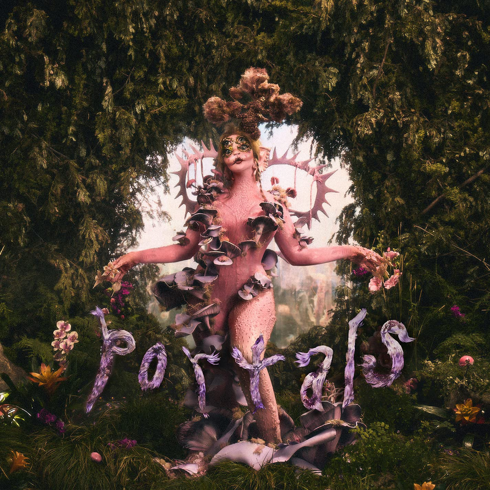

<h1 align="left">Hi 👋! My name is Manuel and I'm a Multiplatform Applications Development Student, from Spain.</h1>

###

  

###

  
  
  
  
  

## 🎵 Mis canciones favoritas

<!-- Canción 1 -->

  
  
Cry Baby

  
Melanie Martinez

  

<!-- Canción 2 -->

  
  
High School Sweethearts

  
Melanie Martinez

  

<!-- Canción 3 -->

  
  
Milk of the Siren

  
Melanie Martinez

  

